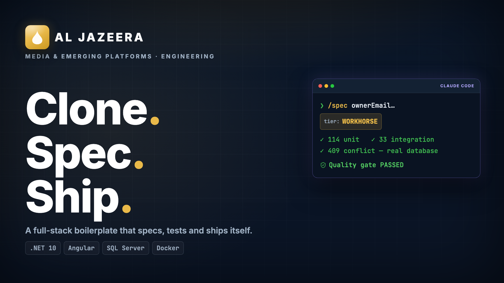
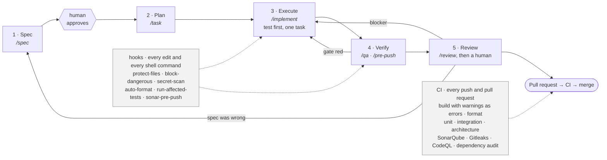

<div align="center">



# Agentic Backend Boilerplate

**A .NET 10 API starting point that ships with its own engineering guardrails.**

[](https://dotnet.microsoft.com/)
[](https://learn.microsoft.com/ef/core/)
[](https://www.keycloak.org/)
[](#licence)

</div>

---

## What this is

Most "starter templates" give you a folder structure and leave the hard parts — layering that
actually holds, an API contract consumers can trust, a quality gate that blocks bad merges,
infrastructure you can read — as an exercise. This one ships those parts working, with a single
sample entity proving the whole path end to end.

It is also built to be driven by [Claude Code](https://claude.com/claude-code). A `.claude/`
harness ships **committed, not gitignored**: hooks that format on save, block dangerous shell
commands, protect sensitive files, run the affected tests, scan for secrets, and gate a push on
the quality gate — plus slash commands for the recurring work.

It contains **no business domain**. The one sample entity, `Item`, is designed to be deleted on
your first day. The other module that ships — the "what's new" feature spotlight — is not a
sample: it is a small piece of product plumbing most applications end up needing, and it is meant
to be kept.

## Why it exists

Every new service re-litigates the same decisions: where do business rules live, what shape is
an error response, who owns the API contract, what blocks a merge, how do we get to two clouds
without forking the codebase. Those decisions are made here, written down as
[ADRs](docs/adr/), and enforced by tests and CI rather than by convention.

## What you get

- **Layered Clean Architecture** — `Domain` → `Application` → `Contracts` → `Infrastructure` →
  `Api`, with an architecture test suite that fails the build when the dependency direction is
  violated. It checks compiled assembly references, so the rule cannot be talked around.
- **A consistent API envelope** — every response is `ApiResponse<T>` with a stable
  machine-readable `code`, a `traceId`, and a documented status-code contract. Exceptions map
  to responses through an `IExceptionHandler` chain, not through try/catch in controllers.
- **OpenAPI as the published contract** — the document is generated from the controllers and
  the contract types, and consumers generate their clients from it. A missing
  `[ProducesResponseType]` is a bug. See [docs/api/](docs/api/).
- **EF Core migration workflow** — MSSQL, migration-based, with two migrations in the box
  (`InitialCreate`, `AddFeatureAnnouncements`, and `AddIdempotencyRecords`) so the workflow is
  demonstrated rather than
  described.
- **A "what's new" feature spotlight** — server-side announcements that surface to each user
  exactly once, on the routes you bind them to, with the dismissal recorded per user so it
  survives cleared browser storage and a second device. Two endpoints, two tables, no seeded
  rows: each announcement ships as its own INSERT-only migration, and no service code changes to
  add one. See [docs/whats-new.md](docs/whats-new.md).
- **Real integration tests** — the suite starts its own SQL Server through Testcontainers,
  applies the migrations, and boots the real pipeline. There is no in-memory provider anywhere,
  on purpose. 245 tests ship green: 185 unit, 9 architecture, 51 integration.
- **Optimistic concurrency, outbox and inbox** — `rowversion` on every audited entity, and the
  messaging tables wired end to end rather than left as a TODO.
- **Two clouds, one switch** — `CLOUD_PROVIDER=gcp|azure` selects the secrets provider and the
  identity issuer at the composition root, and selects which `infra/` tree deploys. Terraform
  for GCP, Bicep for Azure, provisioning the same logical shape.
- **A real quality gate** — build with warnings as errors, `dotnet format` verification, unit +
  integration + architecture tests, SonarQube Community Build (zero new
  Blocker/Critical/Major, ≥80% coverage on new code), Gitleaks, CodeQL, dependency
  vulnerability scanning.
- **The agentic harness** — 8 hooks and the `/spec`, `/task`, `/qa`, `/review`, `/implement`,
  `/pre-push`, `/quality-gate`, `/new-migration` commands, all committed.
- **A written process** — a [five-stage workflow](docs/workflow.md), a
  [Definition of Done](docs/definition-of-done.md), a [spec template](docs/specs/TEMPLATE.md),
  and a [Day-1 onboarding checklist](docs/onboarding.md).
- **An architecture guide that matches the code** — [docs/architecture.md](docs/architecture.md)
  walks every layer: what may and may not live there, what it depends on, the rule the
  architecture tests actually enforce, a real example from the sample slice, and the mistake
  newcomers make with it.

What it is **not**: a platform, a CMS, an auth server, or a deployment you can apply as-is.
`infra/` ships as reviewed IaC with no state and no real project identifiers — you configure a
state backend and your own values before the first `apply`.

## Quickstart (about 5 minutes)

**Prerequisites:** .NET SDK 10, Docker (for the local database and the integration suite), and
a Keycloak realm if you want authorization enforced locally.

```bash
# 1 — clone
git clone https://github.com/Emadkhanqai/aj-boilerplate-be.git
cd aj-boilerplate-be

# 2 — configure. Export what the API needs, or put it in a local .env — either way
#     nothing here is committed; .gitignore already excludes .env and .env.*
cp .env.example .env               # then fill in MSSQL_SA_PASSWORD
export CLOUD_PROVIDER=gcp          # or: azure
export ConnectionStrings__Default='Server=localhost,1433;Database=AjBoilerplate;User Id=sa;Password=<your-local-password>;TrustServerCertificate=True;'
export ConnectionStrings__Redis='localhost:6379'
export APP_DB_CONNECTION="$ConnectionStrings__Default"   # what the design-time factory reads

# 3 — local dependencies
docker network create app-net      # once per host
docker compose up -d db redis

# 4 — database. Applies all three migrations: InitialCreate, AddFeatureAnnouncements,
#     AddIdempotencyRecords.
dotnet tool restore                 # dotnet-ef, pinned in .config/dotnet-tools.json
dotnet ef database update \
  --project        src/AjBoilerplate.Infrastructure \
  --startup-project src/AjBoilerplate.Api

# 5 — run the API  →  http://localhost:5080
dotnet run --project src/AjBoilerplate.Api
```

Open <http://localhost:5080/swagger> and exercise **Items** — create, read, update, and delete a
row. That round trip runs the real middleware order, the envelope filter, the controller, the
use-case service, the repository, and the migration you just applied. **Features** is there too;
it answers an empty array until you ship your first announcement, because the migration seeds no
rows. (Endpoints are
`[Authorize]`d, so you will get a `401` until you point the API at your identity provider and
Keycloak realm — which is the correct answer, not a broken one.)

Then verify the gate is green before you change anything:

```bash
dotnet build  -warnaserror
dotnet format --verify-no-changes
dotnet test                        # all three suites; the integration one needs Docker
```

Full command reference: [CLAUDE.md](CLAUDE.md).

## Toolchain

The SDK is pinned by [`global.json`](global.json) (`10.0.100`, `rollForward: latestFeature`) and the
CLI tools by [`.config/dotnet-tools.json`](.config/dotnet-tools.json). Run this once per clone:

```bash
dotnet tool restore                    # dotnet-ef, swagger — at the versions this repo expects
```

`latestFeature` pins the major/minor so a machine with a newer .NET installed cannot silently build
against it, while still accepting SDK patches and feature bands without a repo change. `dotnet-ef` is
pinned to the same EF Core version the projects reference, so the tool that generates a migration is
never a different version from the one that runs it.

**`global.json` is resolved from the current working directory, not from the project path.** Run
`dotnet` commands from `.` (or below). `dotnet build ...` from the repository
root ignores this file.

## Checks

```bash
dotnet build                           # warnings are errors
dotnet test                            # needs Docker running — see below
dotnet format --verify-no-changes
./scripts/generate-openapi.sh --check  # the committed API contract is current
```

**`dotnet test` requires Docker.** The integration suite starts a real SQL Server container through
Testcontainers, applies the migrations to it, and tears it down; the unit and architecture suites
need nothing. There is no in-memory database provider anywhere in this repository, on purpose: a
suite that cannot see a unique index, a `rowversion`, or the SQL that EF Core actually emits is not
testing the integration. Testcontainers generates the container's password at run time, so no
credential is committed here or in CI.

Adds roughly 10 seconds to a warm run (image cached, container start included) and around a minute
on the first run that has to pull the image.

## Migrations

Schema changes go through EF Core migrations only — never `EnsureCreated`, never hand-written DDL,
and never auto-applied at application startup.

```bash
dotnet ef migrations add <IntentRevealingName> \
  --project src/AjBoilerplate.Infrastructure \
  --startup-project src/AjBoilerplate.Api \
  --output-dir Persistence/Migrations
```

Review the generated `Up`/`Down` before applying. The design-time factory reads its connection
string from `APP_DB_CONNECTION` (not `ConnectionStrings__Default`, which only the running app uses).

### Deploying a schema change

Migrations are **never** auto-applied at application startup. CI builds a
[migration bundle](https://learn.microsoft.com/ef/core/managing-schemas/migrations/applying#bundles) —
a self-contained executable that applies exactly the migrations in that commit — and uploads it as the
`migration-bundle` artefact alongside the idempotent SQL script. The target needs no SDK, no source
tree, and no `dotnet ef`:

```bash
./migrate --connection "$DB_CONNECTION_STRING"
```

The bundle runs **before** the new application version goes live.

### The zero-downtime rule: expand → migrate → contract

For the length of a deployment, the OLD code and the NEW schema are running at the same time. Every
migration must therefore be compatible with the release that is *currently serving traffic*, not only
with the one being deployed. That splits any destructive change across **three** releases:

| Release | Schema | Code |
|---|---|---|
| **1 — expand** | Add the new column/table. Nullable, or with a default. Backfill it. | Write to both old and new; keep reading the old. |
| **2 — migrate** | No destructive change. | Read from the new. The old column is now written but unread. |
| **3 — contract** | Drop the old column/constraint/table. | Nothing references it, and has not for a whole release. |

**Never ship a destructive migration in the same release as the code that stops using the column.**
The moment the bundle runs, every instance still serving traffic is the previous version — and it is
still selecting that column. Dropping it is an immediate, self-inflicted outage, and rolling the code
back does not fix it, because the data is gone.

The same reasoning applies to renames (a rename is a drop plus an add), to narrowing a type, and to
adding a `NOT NULL` column with no default. Prefer additive changes; when one genuinely cannot be
additive, it is three releases, not one.

## The API contract

`docs/api/openapi.json` is **committed**, and CI regenerates it and fails the build if it differs.
The frontend generates its TypeScript types from that file, so it is the contract — and a contract
that can change without anyone noticing is not one.

```bash
./scripts/generate-openapi.sh            # rewrite the snapshot after an intended change
./scripts/generate-openapi.sh --check    # what CI runs
```

No running server and no database: the script loads the built assembly and asks the same
`ISwaggerProvider` the `/swagger` endpoint uses.

When the check fails, read the diff before doing anything. If the change was intended, regenerate and
commit the snapshot **with** the code change so the contract change is reviewed rather than
discovered; if it was not, fix the API. Never regenerate to make the gate quiet. Breaking-change
rules are in [`docs/api/README.md`](docs/api/README.md).

## Idempotency keys

A client can make an unsafe request safely retryable by sending an `Idempotency-Key` header:

```
POST /api/v1/items
Idempotency-Key: <a UUID your client generates once per logical operation>
```

Generate the key once, before the first attempt, and reuse that same value for every retry of
that operation — a key generated per attempt is indistinguishable from no key at all. (The
placeholder above is deliberately not a literal UUID: the repository's secret scan reads a long
opaque token after `Key:` as a credential, and an example that trips your own gate is a bad
example.)

The first request executes and its response is stored; a retry carrying the same key returns that
stored response (with `Idempotency-Replayed: true`) instead of creating a second record. It is
**opt-in per request and POST-only** — traffic without the header is completely unaffected.

| Situation | Result |
|---|---|
| First request | Executes normally |
| Retry, same key, same payload, first one finished | `200`/`201` replay of the original response |
| Retry, same key, first one still running | `409` — retry shortly |
| Same key, **different** payload | `409` — the key was used for a different request |
| First attempt failed (4xx/5xx) | The key is released, so the retry genuinely retries |

Keys are scoped to the **authenticated caller**, so two users choosing the same key never collide and
one can never read back another's response. Only 2xx responses are stored — freezing a transient
failure would make the client's retry key permanently unusable.

Configuration lives under `Idempotency` (`Enabled`, `MaxResponseBytes`, `RetentionHours`). See
[ADR-0009](docs/adr/0009-idempotency-keys-for-unsafe-requests.md).

**Records are not pruned automatically.** A boilerplate should not impose a scheduler, so retention is
yours to run — a nightly job against the index that exists for it:

```sql
DELETE TOP (5000) FROM IdempotencyRecords WHERE CreatedAt < DATEADD(hour, -24, SYSUTCDATETIME());
```

## Feature flags

`IFeatureFlags` with a configuration-backed implementation — no third-party dependency, so the
boilerplate does not pick a flag vendor for you.

```jsonc
// appsettings.json — or Features__NewCheckout=true in the environment
"Features": { "NewCheckout": true }
```

```csharp
if (_features.IsEnabled("NewCheckout")) { /* ... */ }
```

Anything unknown, blank, or not a boolean is **off**: the safe direction to be wrong in. Values are
read through `IConfiguration` on every call, so a provider that reloads on change makes a flag
flippable without a redeploy.

A flag is **not** an authorization check — that is `RoleCapabilities` and the policies. And every flag
is a branch that must be tested both ways, so add one with a plan for deleting it.

To move to a real flag platform, implement `IFeatureFlags` over its SDK and change one registration in
`AddInfrastructure`. No call site changes.

## File storage

`IFileStorage` — the counterpart to `IEmailSender`, so a flow that saves an upload is
storage-agnostic. Keys are opaque, relative, and forward-slash separated (`invoices/2026/03/x.pdf`); a
key that escapes its container is rejected rather than normalised.

**Only the local-disk implementation ships.** The cloud arms of the `CLOUD_PROVIDER` switch are a seam,
not an implementation, and they are honest about it:

| Configuration | Behaviour |
|---|---|
| Nothing configured, Development | `LocalFileStorage` — real round trips under `Storage:LocalRoot` |
| Nothing configured, deployed | Registered but throws on first use, naming what to configure |
| `Storage:Gcp:Bucket` / `Storage:Azure:Container` set | **Fails at startup** with the steps to implement it |

Adding a cloud SDK would put a heavy dependency in every consuming project, including those that store
no files — and an untested implementation nobody has run against a real bucket is worse than none,
because it looks finished. Configuring a bucket is a statement of intent this boilerplate cannot
honour, so it says so at startup rather than silently writing to a container filesystem that
disappears on the next deploy.

To implement one: add the provider SDK to `AjBoilerplate.Infrastructure`, implement `IFileStorage` over
it, and register it in `AddStorage`. Nothing that stores a file changes.

## Cloud provider

`CLOUD_PROVIDER` (bound as `Cloud:Provider`) accepts `gcp` (default) or `azure`. It selects two
things and nothing else:

## Repository map

```
.
├── CLAUDE.md              project context for Claude Code — read this first
├── AjBoilerplate.slnx     the solution: 5 source projects, 3 test projects
├── .claude/               committed agentic harness: hooks, commands, standards, agents
├── .mcp.json              MCP server configuration
├── src/
│   ├── AjBoilerplate.Domain/          entities and invariants — references nothing internal
│   ├── AjBoilerplate.Application/     use cases, ports, validation
│   ├── AjBoilerplate.Contracts/       wire DTOs and the response envelope
│   ├── AjBoilerplate.Infrastructure/  EF Core, cache, transports, cloud secrets
│   └── AjBoilerplate.Api/             controllers, middleware, auth, composition root
├── tests/
│   ├── AjBoilerplate.UnitTests/
│   ├── AjBoilerplate.IntegrationTests/    Testcontainers SQL Server
│   └── AjBoilerplate.ArchitectureTests/   the dependency rule, as compiled-reference assertions
├── docs/
│   ├── adr/               architecture decision records (+ template)
│   ├── specs/             feature specs (+ template)
│   ├── api/               how the OpenAPI contract is produced and consumed
│   ├── handoff/           session handoffs written by the Stop hook
│   ├── architecture.md    every layer, and why each boundary exists
│   ├── whats-new.md       the feature-spotlight module, end to end
│   ├── onboarding.md      Day-1 checklist
│   ├── workflow.md        Spec → Plan → Execute → Verify → Review, with diagrams
│   └── definition-of-done.md
├── .github/
│   ├── workflows/         backend-ci · deploy (+ its reusable per-environment job)
│   └── gitleaks.toml      secret-scanning config; extends the default ruleset
├── infra/
│   ├── gcp/               Terraform: Cloud Run, Cloud SQL, Memorystore, Secret Manager
│   └── azure/             Bicep: Container Apps, Azure SQL, Cache for Redis, Key Vault
├── Dockerfile
└── docker-compose.yml     local SQL Server, Redis, the API, and a migrate profile
```

## How work flows here

Every change — a bug fix, a feature, a refactor — moves through the same five stages, and the same
gates. The solid path is what you do; the shaded gates fire whether or not anyone remembers them.



The distinction matters more than the stages do. The standards, commands, and agents in `.claude/`
are **prose** — an agent reads them, usually follows them, and occasionally does not. The hooks,
the permission policy, the architecture tests, and CI are **deterministic**: they fire every time,
identically, and a `PreToolUse` hook can refuse a tool call before it happens. That is why a rule
worth enforcing lives in a hook rather than only in a document.

The full picture — every stage, every hook, which agent does what, and one small feature followed
through all five stages with real commands — is in **[docs/workflow.md](docs/workflow.md)**.

## Related repositories

The same boilerplate is published in three shapes. Pick the one that matches your project — the
single-stack repos are derived from the full-stack one, not forks that drift. See
[ADR-0006](docs/adr/0006-three-repository-split.md).

| Repository | Contents |
|---|---|
| [`aj-boilerplate-fs`](https://github.com/Emadkhanqai/aj-boilerplate-fs) | The source of truth — backend + frontend + infra |
| [`aj-boilerplate-be`](https://github.com/Emadkhanqai/aj-boilerplate-be) | This repo — backend only, promoted to the repo root |
| [`aj-boilerplate-fe`](https://github.com/Emadkhanqai/aj-boilerplate-fe) | Frontend only, promoted to the repo root |

All three share `.claude/`, the stack-neutral pages of `docs/`, `.gitignore`, and
`.editorconfig`.

## CI configuration

The workflows in `.github/workflows/` need the following repository settings. They are **not**
included and CI will not pass until you provide them. Cloud authentication uses GitHub OIDC —
there are no long-lived cloud credentials in any workflow, and none should ever be added.

**Repository variables** (*Settings → Secrets and variables → Actions → Variables*)

| Variable | Used by | Purpose |
|---|---|---|
| `CLOUD_PROVIDER` | deploy | `gcp` or `azure` — selects which IaC runs |
| `SONAR_HOST_URL` | backend CI | Your SonarQube server URL. **The quality-gate job skips itself while this is unset** — see the comment in `backend-ci.yml` and remove the guard once you have a server. |
| `SONAR_PROJECT_KEY` | backend CI | The project key on that server |
| `API_IMAGE` | deploy | Container image for the API, tag or digest |
| `NAME_PREFIX` | deploy (gcp) | Short resource-name prefix, 12 characters or fewer |
| `GCP_PROJECT_ID` · `GCP_REGION` | deploy (gcp) | Target project and region |
| `TF_STATE_BUCKET` | deploy (gcp) | Existing GCS bucket holding Terraform state |
| `AZURE_LOCATION` · `AZURE_NAME_PREFIX` | deploy (azure) | Target region and resource-name prefix |
| `AZURE_SQL_ADMIN_OBJECT_ID` · `AZURE_SQL_ADMIN_LOGIN` | deploy (azure) | Entra principal (use a group) that administers Azure SQL |

**Repository secrets**

| Secret | Used by | Purpose |
|---|---|---|
| `SONAR_TOKEN` | backend CI | SonarQube analysis token |
| `GCP_WORKLOAD_IDENTITY_PROVIDER` | deploy (gcp) | Full workload identity provider resource name |
| `GCP_SERVICE_ACCOUNT` | deploy (gcp) | Service account CI impersonates |
| `AZURE_CLIENT_ID` · `AZURE_TENANT_ID` · `AZURE_SUBSCRIPTION_ID` | deploy (azure) | Federated identity credential for OIDC |
| `GITLEAKS_LICENSE` | backend CI | Optional. Only needed for organisation-owned **private** repositories; Gitleaks is free on public ones. |

The SonarQube side targets **Community Build**, the free self-hosted edition: one project, one
branch, no pull-request decoration. The quality-gate job is deliberately guarded to `push` on
`main` for that reason — see [`.claude/standards/sonarqube.md`](.claude/standards/sonarqube.md).

Both cloud paths bootstrap themselves: the identity CI uses is created by the same IaC, so the
first deployment is run locally and the resulting values become the secrets above. Both
`infra/*/README.md` files walk through it.

**Environments** — create `dev`, `staging`, and `prod` under *Settings → Environments*. Add
required reviewers to `staging` and `prod`. Those protection rules **are** the approval gates in
`deploy.yml`; without them it promotes straight to production unreviewed.

## Contributing

Read [docs/workflow.md](docs/workflow.md) and [docs/definition-of-done.md](docs/definition-of-done.md)
before opening a pull request, and [docs/architecture.md](docs/architecture.md) before your first
change. In short: spec first, failing test first, keep the diff small, green gate, and a human
reviews every change — including the ones an agent wrote.

## Licence

See [`LICENSE`](LICENSE). It is an **all-rights-reserved notice**, not a grant: it records the
status quo (a repository with no licence file is already all rights reserved) so that the position
is explicit rather than merely implied. Two things still need a human:

- the copyright holder placeholder on line 3 must be replaced with the organisation that owns
  this work, and
- if the intention is for others to reuse this, an actual open-source licence has to be chosen
  deliberately. Nothing here does that for you.
