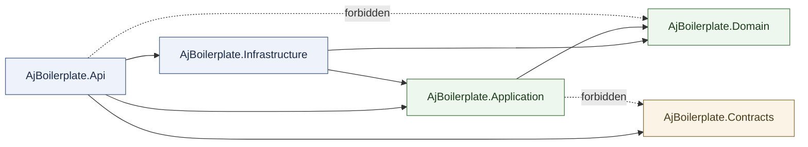
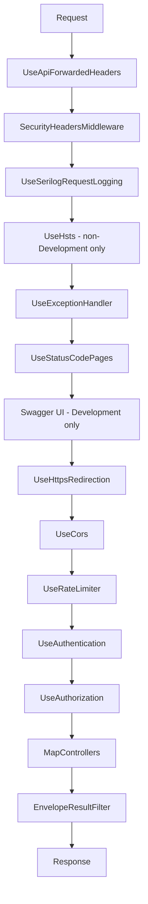
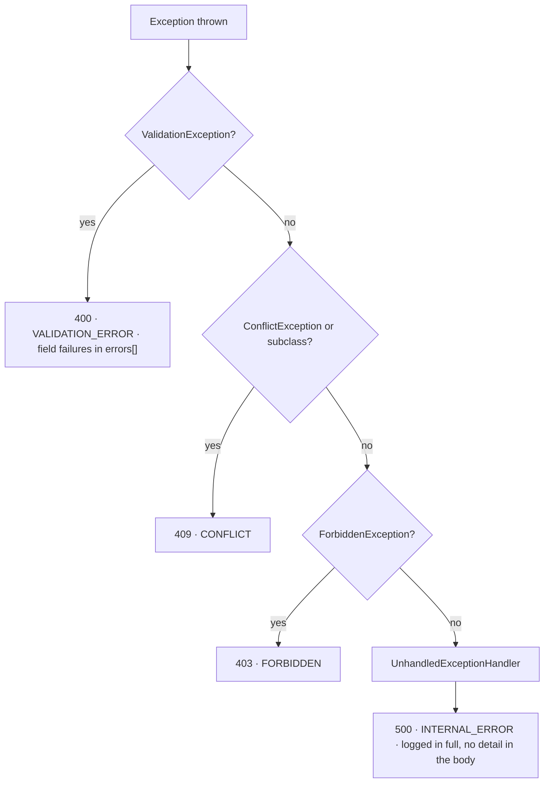
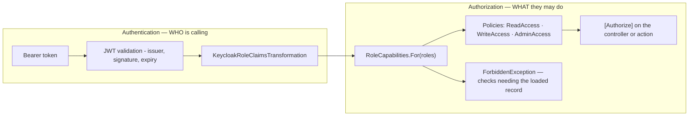
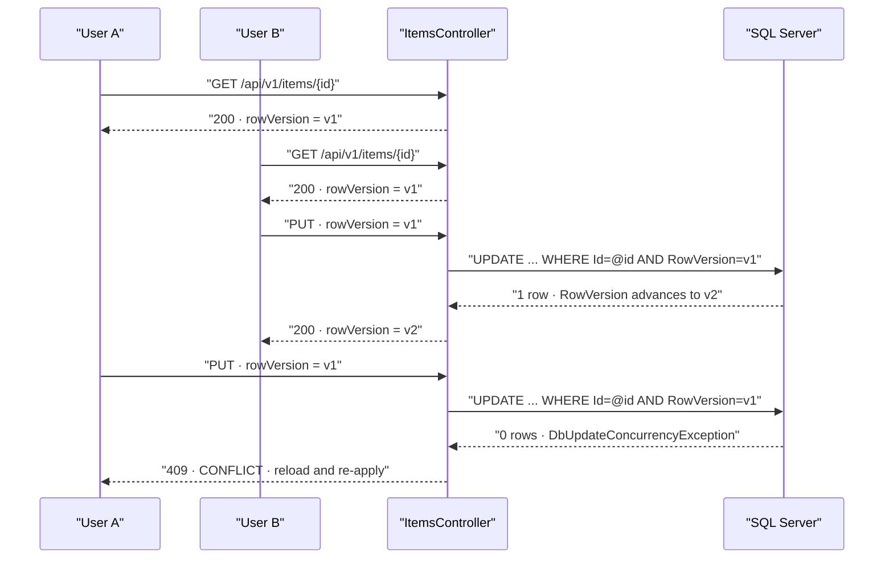
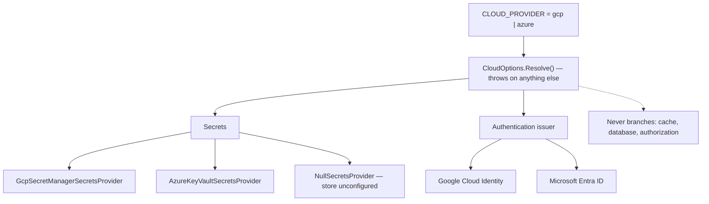
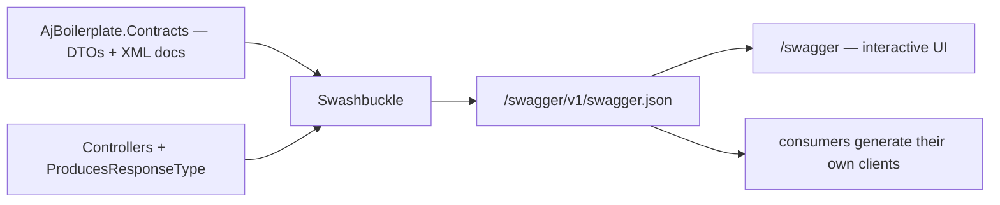

# Architecture

A layer-by-layer tour of the repository, written for someone who cloned it ten minutes ago.

Every layer below is described the same way: **what it is for**, **what may live there**, **what
may not**, **what it depends on**, **a concrete example with real file paths**, and **the mistake
newcomers actually make** with it.

Two modules ship, and each layer is illustrated with both. `Item` is the **sample slice** — it
proves the path end to end and is meant to be deleted on day one. `Features` is the **"what's
new" feature spotlight**, a real module that is meant to be kept; it shows the same layering
carrying an actual behaviour rather than a demonstration. Its own end-to-end reference, including
how to ship an announcement, is [whats-new.md](whats-new.md).

The short version: dependencies point inward, the wire contract is a separate thing from the
domain model, and both rules are enforced by tests rather than by good intentions.

This is the backend-only repository. The frontend counterpart lives in
[`aj-boilerplate-fe`](https://github.com/Emadkhanqai/aj-boilerplate-fe), and the two together in
[`aj-boilerplate-fs`](https://github.com/Emadkhanqai/aj-boilerplate-fs) — see
[ADR-0006](adr/0006-three-repository-split.md).

**Contents**

- [The backend](#the-backend)
  - [The dependency rule, and the tests that enforce it](#the-dependency-rule-and-the-tests-that-enforce-it)
  - [`AjBoilerplate.Domain`](#ajboilerplatedomain)
  - [`AjBoilerplate.Application`](#ajboilerplateapplication)
  - [`AjBoilerplate.Contracts`](#ajboilerplatecontracts)
  - [`AjBoilerplate.Infrastructure`](#ajboilerplateinfrastructure)
  - [`AjBoilerplate.Api`](#ajboilerplateapi)
  - [The three test projects](#the-three-test-projects)
- [Why these boundaries exist](#why-these-boundaries-exist)
- [Cross-cutting machinery](#cross-cutting-machinery)
  - [The request pipeline](#the-request-pipeline)
  - [How an exception becomes a status code](#how-an-exception-becomes-a-status-code)
  - [The response envelope](#the-response-envelope)
  - [Correlation ids](#correlation-ids)
  - [Where authentication ends and authorization begins](#where-authentication-ends-and-authorization-begins)
  - [Optimistic concurrency](#optimistic-concurrency)
  - [Outbox and inbox](#outbox-and-inbox)
  - [The `CLOUD_PROVIDER` switch and `ISecretsProvider`](#the-cloud_provider-switch-and-isecretsprovider)
- [The published contract](#the-published-contract)
- [Deleting the sample slice](#deleting-the-sample-slice)

---

## The backend

Five source projects and three test projects, all listed in
`AjBoilerplate.slnx`:

```
.
├── src/
│   ├── AjBoilerplate.Domain/          entities and invariants — references nothing internal
│   ├── AjBoilerplate.Application/     use cases, ports, validation
│   ├── AjBoilerplate.Contracts/       wire DTOs and the response envelope
│   ├── AjBoilerplate.Infrastructure/  EF Core, cache, transports, cloud secrets
│   └── AjBoilerplate.Api/             controllers, middleware, auth, composition root
└── tests/
    ├── AjBoilerplate.UnitTests/
    ├── AjBoilerplate.IntegrationTests/
    └── AjBoilerplate.ArchitectureTests/
```

### The dependency rule, and the tests that enforce it

Here is the whole rule as one picture. An arrow means "may reference"; anything not drawn is
forbidden.



Those two dotted arrows are the interesting part, and both are asserted directly. The rules are
not a convention in a document — they are xUnit facts in
`tests/AjBoilerplate.ArchitectureTests/DependencyRuleTests.cs`, which inspects each
assembly's **compiled references** via `Assembly.GetReferencedAssemblies()`:

| Test | What it asserts |
|---|---|
| `Domain_depends_on_nothing_internal` | `Domain` references none of `Application`, `Infrastructure`, `Api`, `Contracts` |
| `Application_does_not_depend_on_infrastructure_or_api` | `Application` references neither `Infrastructure` nor `Api` |
| `Application_does_not_depend_on_the_wire_contracts` | `Application` does **not** reference `Contracts` |
| `Infrastructure_does_not_depend_on_api` | `Infrastructure` does not reference `Api` |
| `Contracts_contains_no_dependency_on_other_layers` | `Contracts` references no other layer at all |
| `Api_does_not_reference_domain_directly` | `Api` does **not** reference `Domain` |

The file's own comment explains why it checks compiled references rather than `using`
statements: *"a using-statement grep can be satisfied by a fully qualified name, but an assembly
reference cannot be hidden. If one of these fails, the fix is almost never to relax the test — it
is to move the type that leaked across the boundary."*

A second file, `tests/AjBoilerplate.ArchitectureTests/ControllerConventionTests.cs`,
enforces three controller conventions by reflection over every non-abstract `ControllerBase`:

| Test | What it asserts |
|---|---|
| `There_is_at_least_one_controller_to_check` | the reflection filter matched something, so the two below cannot pass vacuously |
| `Every_controller_is_authorized_or_explicitly_anonymous` | every controller carries `[Authorize]` **or** an explicit `[AllowAnonymous]` — an endpoint's authentication posture is never implicit |
| `Every_controller_route_is_versioned` | every controller's `[Route]` template starts with `api/v` |

Run them on their own:

```bash
dotnet test tests/AjBoilerplate.ArchitectureTests
```

They need no database and no container, so they are the cheapest gate in the repository.

---

### `AjBoilerplate.Domain`

**Single responsibility.** Hold the business objects and the rules that must be true of them
regardless of how they are stored, transported, or displayed.

**May live here**

- Aggregate roots and entities with private setters and validating factory methods
- Enums describing a lifecycle
- `DomainException`, for an invariant violation
- Small pure helpers over domain values (`Common/PrivacyHash.cs` hashes an IP or user agent that
  an audit row may correlate on but must never store raw; `Features/FeaturePath.cs` canonicalises
  a URL path before anything compares it)
- Base types shared by every persisted root — `Common/AuditedEntity.cs` carries `CreatedAt`,
  `UpdatedAt`, and the `RowVersion` concurrency token

**May not live here**

- EF Core, ASP.NET Core, Serilog, a cloud SDK, or any other framework — check
  `src/AjBoilerplate.Domain/AjBoilerplate.Domain.csproj` and note that it has **zero**
  `PackageReference` and **zero** `ProjectReference` entries
- Persistence concerns: no attributes, no navigation-property tricks that only exist for the ORM
- Role vocabulary. `Common/Actor.cs` records *who acted* and treats `Role` as an opaque tag; the
  Domain never enumerates roles

**Depends on.** Nothing. It is the innermost layer.

**In the sample slice.** `src/AjBoilerplate.Domain/Items/Item.cs` is a deliberately
complete example of the house style, not a stub:

- a private constructor plus a `Create` factory that normalises and bounds its inputs
- all mutation through behaviour methods (`Update`, `Archive`, `Restore`) rather than public setters
- invariants raised as `DomainException` **inside the entity** — an archived item cannot be
  edited, and the check lives in `Item.Update`, not in the controller
- `Archive` is idempotent on purpose, so a retried request cannot fail for having already succeeded
- length limits as constants (`Item.MaxNameLength`, `Item.MaxDescriptionLength`) that the EF
  configuration and the request validators both read, so all three cannot drift

**In the `Features` module.** Three files, and one of them is a security control:

- `src/AjBoilerplate.Domain/Features/FeatureAnnouncement.cs` — the aggregate, in the same house
  style: private constructor, a `Create` factory that trims and bounds every input against
  `MaxKeyLength` / `MaxTitleLength` / `MaxBodyLength` / `MaxPagesJsonLength`, and mutation only
  through `Retire` and `Reinstate`, both idempotent. It also answers the question the whole module
  turns on — `Targets(requestPath)`, "do I apply to this route?"
- `src/AjBoilerplate.Domain/Features/FeatureAcknowledgement.cs` — one user's dismissal of one
  announcement. Its `MaxUserIdLength` is **128 characters, not a `Guid`**, because the user
  identifier is `Actor.Id`: an opaque subject claim issued by an external identity provider, which
  is not this schema's key to shape
- `src/AjBoilerplate.Domain/Features/FeaturePath.cs` — canonicalises the path a caller claims to
  be on. Page targeting is a prefix comparison, and comparing against an *unresolved* path is
  exploitable: `/reports/../admin` literally starts with `/reports`, so an announcement scoped to
  the reports area would fire on what every other consumer of that URL resolves to `/admin`.
  `Normalize` drops the query string and fragment and resolves `.` and `..` on a stack before any
  comparison happens, and `..` can never walk above the root

Two deliberate degradations live here rather than in a service. An **empty page list matches every
route**, and a `PagesJson` value that cannot be parsed degrades to exactly the same thing instead
of throwing — this code runs on a lookup the client fires on every navigation, and one malformed
row must not become a 500 for every user on every page. An announcement carries no authority, so
showing one too widely is cosmetic; a broken targeting query is not.

**The common mistake.** Reaching for a framework "just for this one thing" — a `[Required]`
attribute, an `IQueryable`, a `DateTime.UtcNow`. The moment the Domain has a package reference, it
stops being independently testable and every rule in it becomes hostage to a framework upgrade.
The second most common mistake is a public setter: once `item.Status = ItemStatus.Archived` is
legal from the outside, the invariant in `Update` is decoration. The `Features` version of the
same error is hoisting `FeaturePath.Normalize` out to the caller to "avoid normalising twice":
`Targets` applies it itself so that no future caller can forget the guard, and normalisation is
idempotent, so applying it twice costs nothing.

---

### `AjBoilerplate.Application`

**Single responsibility.** Express the use cases. This layer knows *what the system does*; it
does not know how anything is stored or transported.

**May live here**

- Use-case services and their interfaces — `Items/ItemService.cs` and `IItemService`,
  `Features/FeatureAnnouncementService.cs` and `IFeatureAnnouncementService`
- **Ports**: interfaces the outer layers implement. `Abstractions/` holds `IClock`,
  `ICurrentActor`, `ICorrelationContext`, `IEmailSender`, `ISecretsProvider`,
  `IOutboxRepository`, `IInboxRepository`, `IIntegrationEventPublisher`, `IEntityIdCodec`;
  `Items/IItemRepository.cs` and `Features/IFeatureAnnouncementRepository.cs` are the two
  persistence ports
- Commands, queries, and the layer's own read models — `Items/ItemModels.cs`,
  `Features/FeatureModels.cs`
- Well-known identity values both the Api's claims reader and the use cases must agree on —
  `Identity/ActorIdentifiers.cs`
- FluentValidation validators, declared **on the command**, not on the wire DTO
- Application-level exceptions that describe an outcome rather than a transport:
  `Common/ApplicationExceptions.cs` defines the abstract `ConflictException` and `ForbiddenException`
- Shared paging bounds — `Common/Paging.cs`

**May not live here**

- A `DbContext`, a connection string, an HTTP client, a cloud SDK call
- `DateTime.UtcNow`. Take `IClock` instead
- Any `AjBoilerplate.Contracts` type. The architecture test
  `Application_does_not_depend_on_the_wire_contracts` fails the build if one appears

**Depends on.** `AjBoilerplate.Domain` only, plus a small, justified package set. Two of those
packages deserve a note, because they look like leaks and are not:

- `Microsoft.EntityFrameworkCore` — for `DbUpdateConcurrencyException`, the type
  `ItemService.UpdateAsync` catches to turn a lost race into a `StaleItemException`
- `Microsoft.Data.SqlClient` — read only for the SQL Server error numbers in
  `Persistence/SqlDeadlockVictim.cs` (error 1205) and `Persistence/SqlUniqueConstraintViolation.cs`,
  so a lost race becomes a clean idempotent or 409 result instead of a raw 500. The `.csproj`
  carries the reasoning inline

**In the sample slice.** `src/AjBoilerplate.Application/Items/ItemService.cs` shows the
whole shape: validate the command, load through the port, drive the domain method, save, map to
the layer's own `ItemDto`. Note what it does **not** do — it never constructs an HTTP response and
never mentions a status code. `GetAsync` returns `null` for a missing item, because "not found" is
a foreseeable outcome, not an exception; `UpdateAsync` throws `StaleItemException` (a
`ConflictException`) for a lost concurrency race, because that genuinely is exceptional.

`Items/ItemModels.cs` also holds `ItemStatusNames`, the one place that translates between the
`ItemStatus` enum and its wire name in both directions. Its own comment names the bug it prevents:
a validator that accepts a value the parser then silently maps to the enum's default.

`Items/ItemValidators.cs` puts the rules on the command rather than on the DTO, so **every** caller
of the use case is validated — including one that never arrived over HTTP. It also draws a line
worth copying: a missing or malformed `RowVersion` is a 400 (a client bug), never a 409, because a
409 would tell the user someone else had edited the record when nobody had.

**In the `Features` module.** `src/AjBoilerplate.Application/Features/FeatureAnnouncementService.cs`
holds both use cases, and each one makes a decision worth reading before you copy the pattern:

- `GetUnacknowledgedAsync` runs **two narrow reads instead of a join** — the active set is tiny and
  already ordered by its index, and the second query seeks the same `(UserId, FeatureId)` unique
  index that guarantees one acknowledgement per user. Page-list matching then happens **in memory**,
  because matching means parsing a JSON array and resolving the caller's path: work SQL Server would
  do badly and could not index anyway
- `AcknowledgeAsync` **computes idempotency itself** rather than catching a constraint violation. It
  subtracts the ids this user has already acknowledged, so a double-click or a retried request
  writes nothing and returns success — instead of raising a unique-constraint violation that would
  have to be caught, classified by SQL error number, and translated back into the success it always
  was. It also drops an id that names no existing announcement rather than inserting it, so a stale
  id from a client cannot trip the foreign key and turn a dismissal into a 500
- Both call `RequireAuthenticatedUser`, which refuses the `anonymous` and `system` identifiers from
  `Identity/ActorIdentifiers.cs`. The endpoint policy already rejects an anonymous caller; this is
  defence in depth for any other entry point, because attributing acknowledgement rows to a shared
  pseudo-identity would mark an announcement dismissed for everyone who is not signed in

`Features/FeatureValidators.cs` bounds the two requests — a path of at most 2048 characters, and at
most 200 ids per dismissal. An **empty** id list is deliberately valid: dismissing nothing is a
successful no-op, not a client error.

**The common mistake.** Putting the business rule in the service instead of the entity. If
`ItemService` had checked `if (item.Status == ItemStatus.Archived) throw`, the rule would apply only
to that one code path. It lives in `Item.Update` so it applies to every caller forever. The second
most common mistake is injecting `AppDbContext` "temporarily" — the moment that happens, the layer
can no longer be unit-tested without a database, and the port was pointless.

---

### `AjBoilerplate.Contracts`

**Single responsibility.** Describe the wire. These are the only shapes that cross the API
boundary, and the OpenAPI document is generated from them.

**May live here**

- Request and response records — `Items/ItemContracts.cs` holds `ItemResponse`,
  `CreateItemRequest`, `UpdateItemRequest`; `Features/FeatureContracts.cs` holds
  `FeatureAnnouncementResponse` and `AcknowledgeFeaturesRequest`
- The envelope — `Common/ApiResponse.cs` (generic and non-generic) and `Common/PagedResponse.cs`
- `Common/EnvelopeCodes.cs`: the stable `code` slugs a client branches on
- XML documentation comments, which become the descriptions in the generated OpenAPI document.
  `AjBoilerplate.Contracts.csproj` sets `GenerateDocumentationFile` for exactly that reason, and
  `Program.cs` feeds `AjBoilerplate.Contracts.xml` into `IncludeXmlComments`

**May not live here**

- Logic of any kind. These are records and constants
- Any reference to another layer. `Contracts_contains_no_dependency_on_other_layers` asserts it
- A domain enum. `ItemResponse.Status` is a `string`, not `ItemStatus` — see below

**Depends on.** Nothing.

**In the sample slice.** `src/AjBoilerplate.Contracts/Items/ItemContracts.cs`.
`ItemResponse.RowVersion` is a base64 `string`, while the Application layer's `ItemDto.RowVersion`
is a `byte[]`; the controller converts between them. That is the pattern in miniature — the wire
shape is chosen for clients, the internal shape for correctness, and one place maps between them.

**In the `Features` module.** `src/AjBoilerplate.Contracts/Features/FeatureContracts.cs` is the
same idea with a different payoff. `FeatureAnnouncementResponse` publishes only what a client needs
to render and dismiss a popup — and notably **not** `PagesJson` or `IsActive`, which are targeting
and lifecycle state that no client has any business seeing. `AcknowledgeFeaturesRequest.FeatureIds`
is nullable on the wire and normalised to an empty list by the controller, so a body of `{}` is an
accepted no-op rather than a null-reference deep in a use case.

**The common mistake.** Returning the EF entity because it "has the same fields". It does not:
it has navigation properties that serialise into loops or over-fetch, private setters that model
binding will happily bypass on the way in, and internal fields nobody meant to publish. Worse, it
welds the wire contract to the schema — the next migration becomes a breaking API change by
accident.

---

### `AjBoilerplate.Infrastructure`

**Single responsibility.** Implement the ports the Application layer declared, using real
technology.

**May live here**

- `Persistence/AppDbContext.cs`, the entity configurations under `Persistence/Configurations/`,
  the repositories, and the migrations under `Persistence/Migrations/`
- `Time/SystemClock.cs` — the only place in the codebase that reads the machine's wall clock
- `Secrets/` — `GcpSecretManagerSecretsProvider`, `AzureKeyVaultSecretsProvider`,
  `NullSecretsProvider`
- Transports: `Email/SmtpEmailSender.cs` and its logging no-op counterpart,
  `Messaging/LoggingIntegrationEventPublisher.cs`
- `Security/AesEntityIdCodec.cs`, `Health/DbContextHealthCheck.cs`
- `DependencyInjection.cs`, the layer's composition root

**May not live here**

- A business rule. If a repository decides something, that decision has escaped the domain
- Anything from `AjBoilerplate.Api`. `Infrastructure_does_not_depend_on_api` asserts it
- A cloud branch outside the one place that owns it — see
  [the `CLOUD_PROVIDER` switch](#the-cloud_provider-switch-and-isecretsprovider)

**Depends on.** `Application` and `Domain`.

**In the sample slice.** `Persistence/ItemRepository.cs` is the reference implementation of a
repository: `AsNoTracking()` on the read-only list projection, `EF.Functions.Like` so the search
runs as real SQL rather than a client-side `Contains` that would pull the table into memory, LIKE
metacharacters escaped so a user typing `%` does not get a wildcard, `Count` and `Skip`/`Take` both
executed in the database, and an ordering of `(CreatedAt desc, Id)` rather than `CreatedAt` alone —
because an unstable sort makes paging skip and repeat rows.

`Persistence/Configurations/ItemConfiguration.cs` maps the table and stores `Status` **as its
name** (`HasConversion<string>()`), so reordering the enum can never silently reinterpret existing
rows.

`Persistence/AppDbContext.cs` carries one subtle global convention worth reading before you add a
`DateTime` column: SQL Server `datetime2` is Kind-less, so a reloaded value comes back
`Unspecified` and `System.Text.Json` then serialises it without the trailing `Z`. The context
re-labels Kind on the way in and out. New timestamps should prefer `DateTimeOffset`, which
round-trips unambiguously — the sample `Item` does.

**In the `Features` module.** This is where the module's **second set of tables** lives —
`feat_Features` and `feat_Acknowledgements`, mapped by
`Persistence/Configurations/FeatureAnnouncementConfiguration.cs` and
`Persistence/Configurations/FeatureAcknowledgementConfiguration.cs`, and created by the
`20260803100548_AddFeatureAnnouncements` migration alongside the `InitialCreate` one.

Four indexes, each earning its place:

| Index | Table | Why |
|---|---|---|
| `IX_feat_Features_Key` (unique) | `feat_Features` | The stable handle the next announcement migration writes against; unique, so a copy-pasted key fails the migration instead of silently shipping a duplicate |
| `IX_feat_Features_Active_Order` | `feat_Features` | Covers the hot path exactly — filter on `IsActive`, order by `DisplayOrder`. This lookup runs on every navigation of every signed-in client |
| `IX_feat_Acknowledgements_User_Feature` (unique) | `feat_Acknowledgements` | **A correctness constraint, not tuning.** It is what makes a dismissal permanent and un-duplicable when two requests race past the application's own idempotency check — and it is the index the "has this user seen it?" lookup seeks on |
| `IX_feat_Acknowledgements_FeatureId` | `feat_Acknowledgements` | EF Core's index for the foreign key, which cascades |

Two mapping decisions are worth copying. `UserId` is `nvarchar(128)` with **no foreign key**: users
live in the identity provider, not in this schema, so there is nothing to point at. And deleting an
announcement **cascades** to its acknowledgements, because they mean nothing without it and leaving
them would either block the delete or strand orphan rows.

`Persistence/FeatureAnnouncementRepository.cs` orders by `(DisplayOrder, CreatedAt, Id)`. The first
two are the documented contract; `Id` breaks a remaining tie so two announcements created in the
same tick with the same order still have a stable sequence rather than whatever the engine returns.

**The migration creates the two tables and their indexes and nothing else — it seeds no
announcement rows.** That is the design, not an omission: an empty announcements table is the
correct state for a fresh clone, and each real announcement ships later as its own INSERT-only
migration with no service or schema change. [whats-new.md](whats-new.md) has that workflow.

**The common mistake.** Letting a query decide policy. "The repository filters out archived items"
sounds harmless until a second caller needs them and the rule is invisible from the use case. Ports
return data; use cases decide. The other recurring mistake is `EnsureCreated()` — the schema here
is owned exclusively by migrations, and `EnsureCreated` produces a database that no migration has
ever been applied to, which then diverges from every deployed environment.

---

### `AjBoilerplate.Api`

**Single responsibility.** Compose everything, map HTTP to use cases and back, and own the
cross-cutting middleware.

**May live here**

- Thin controllers — `Controllers/ItemsController.cs`, `Controllers/FeaturesController.cs`
- The composition root, `Program.cs`
- Cross-cutting middleware and filters under `Infrastructure/`: the exception handlers, the
  envelope result filter, the status-code pages, security headers, rate limiting, CORS,
  forwarded headers
- Authentication and policy wiring under `Identity/`
- Configuration sources under `Configuration/`, observability under `Observability/`, and the
  hosted service that drives the outbox under `Messaging/`

**May not live here**

- Business rules. A controller that contains an `if` about the domain has taken a rule from
  somewhere it belonged
- A hand-built error response. `EnvelopeResultFilter` and the handler chain own that
- Any `AjBoilerplate.Domain` type. `Api_does_not_reference_domain_directly` asserts it

**Depends on.** `Application`, `Infrastructure`, `Contracts` — and deliberately **not** `Domain`.

**In the sample slice.** `src/AjBoilerplate.Api/Controllers/ItemsController.cs` is one of the two
controllers that ship. Everything about it is intentional:

- `[Route("api/v1/items")]` — versioned from day one, as `Every_controller_route_is_versioned` requires
- `[Authorize(Policy = Policies.ReadAccess)]` on the class, `[Authorize(Policy = Policies.WriteAccess)]`
  on each mutation, so a viewer can list and fetch but change nothing
- No action builds an envelope. They return `Ok(...)`, `NotFound()`, `CreatedAtAction(...)`,
  `NoContent()`, and `EnvelopeResultFilter` wraps the result globally
- `ParseRowVersion` decodes the base64 token and returns an empty array for garbage, so the command
  validator turns malformed input into a clean 400 rather than an unhandled 500
- `ProducesResponseType` for the failures as well as the success, because the OpenAPI document is
  only as good as its annotations and a client generated from a happy-path-only document has no
  idea how the endpoint fails

**In the `Features` module.** `src/AjBoilerplate.Api/Controllers/FeaturesController.cs` publishes
the module's two endpoints, and its authorization is the interesting part:

| Endpoint | Policy | Answers |
|---|---|---|
| `GET /api/v1/features/unack?path=…` | `Policies.ReadAccess` | `200` with this user's pending announcements for that path, ordered by `DisplayOrder` then `CreatedAt` — an empty array when there is nothing to show |
| `POST /api/v1/features/ack` | `Policies.ReadAccess` | `204`, idempotent |

Both sit at **read** level — the widest policy here, satisfied by every recognised role — and the
dismissal endpoint deliberately does **not** require `Policies.WriteAccess`. It writes a row about
the *caller*, not about a business record, and gating it behind a write privilege would leave a
read-only user permanently unable to close a popup they can see. That is the kind of decision worth
making explicitly rather than by reflex: "it writes, therefore it is `WriteAccess`" produces a
defect here, not a control.

The controller stays thin in the usual way — it maps `FeatureAnnouncementDto` to
`FeatureAnnouncementResponse` and normalises a null `FeatureIds` to an empty list, and nothing else.
The path is *not* sanitised here: canonicalisation belongs to the domain, where
`FeatureAnnouncement.Targets` applies it and no caller can skip it.

**The common mistake.** Doing work in the controller. The tell is a `try`/`catch` — if an action
catches an exception to shape a response, it is duplicating the handler chain and will drift from
it. The other classic is adding a `using AjBoilerplate.Domain...` to "just map the enum", which
breaks the build at the architecture test rather than at review, which is exactly the intent.

---

### The three test projects

| Project | What it proves | Needs |
|---|---|---|
| `AjBoilerplate.UnitTests` | Domain invariants, use-case branches, validators, mappers, the claims and role tables, the log sanitizer, the id codec — including path canonicalisation (`Features/FeaturePathTests.cs`), announcement targeting, and the acknowledgement idempotency rules | nothing |
| `AjBoilerplate.IntegrationTests` | The real request path end to end against a real SQL Server — `Api/ItemsApiTests.cs`, `Api/FeaturesApiTests.cs`, the pipeline, and the concurrency and constraint behaviour | Docker |
| `AjBoilerplate.ArchitectureTests` | The dependency rule and the controller conventions | nothing |

The integration suite is worth understanding before you write your first test.
`Support/SqlServerFixture.cs` starts **one** throwaway SQL Server container
(`mcr.microsoft.com/mssql/server:2022-latest`) via Testcontainers for the whole suite, applies the
EF Core migrations to it, and shares it across every class in `DatabaseCollection`. There is no
in-memory provider anywhere in this repository, on purpose: a suite that cannot see a unique index,
a real `rowversion`, or the SQL that EF Core actually emits is not testing the integration.
Testcontainers generates the container password at run time, so no credential is committed.

`Support/ApiFactory.cs` boots the real application — the real middleware order, the real handler
chain, the real envelope filter, the real policies — and swaps exactly two things: the
authentication scheme (for `Support/TestAuthHandler.cs`, so a test can act as a role without a live
identity provider) and the connection string. It supplies the connection string as an **environment
variable** rather than through `ConfigureAppConfiguration`, and the file explains why: `Program.cs`
reads `ConnectionStrings:Default` during service registration, before `builder.Build()`, which is
when a test host's configuration callbacks are applied.

```bash
dotnet test tests/AjBoilerplate.UnitTests          # fast, no dependencies
dotnet test tests/AjBoilerplate.ArchitectureTests  # fast, no dependencies
dotnet test tests/AjBoilerplate.IntegrationTests   # needs Docker running
```

---

## Why these boundaries exist

Boundaries that nobody can explain get deleted the first time they are inconvenient. Here is the
reasoning for the four that surprise people most.

### Why `Api` must not reference `Domain`

This is the rule that shapes the most code, so it is worth being precise. If the Api project could
see `AjBoilerplate.Domain`, the path of least resistance would be to bind an entity to a request
body or serialise one into a response — and the wire contract would then be whatever the schema
happens to be this week. Removing the reference makes that physically impossible rather than merely
discouraged.

Read what it costs, because the cost is visible in the code:

- `ItemDto.Status` (Application layer) is a `string`, not the `ItemStatus` enum, so the enum type
  stops at that boundary
- `ItemStatusNames` in `src/AjBoilerplate.Application/Items/ItemModels.cs` owns the
  string-to-enum translation in both directions
- `IActorClaims` in `src/AjBoilerplate.Application/Identity/IActorClaims.cs` exposes the
  authenticated caller as **primitive strings only**. The Api implements it over `HttpContext.User`
  (`Identity/HttpContextActorClaims.cs`), and `ClaimsCurrentActor` — in the Application layer — is
  the only place that turns those primitives into a domain `Actor`

That last one is the clearest illustration: the Api layer never constructs a domain type, so it
never needs the reference, so the test can assert the reference is absent. The boundary is not
paperwork; it is why those two files exist in the shape they do.

### Why DTOs never expose EF entities

An entity is a *model of a rule*. A DTO is a *promise to a client*. They change for entirely
different reasons — an index, a column split, or a navigation property is a schema decision, while
adding a field or widening a type is a contract decision that has to be versioned. Fusing them means
every schema change is a potential breaking API change, and the breakage is discovered by the
client, in production.

There is a security dimension too. Model binding onto an entity is how mass assignment happens: a
request that includes `"rowVersion": "..."` or `"createdAt": "..."` gets to set fields the client
was never meant to control. `CreateItemRequest` simply has no such properties.

### Why `IClock` exists instead of `DateTime.UtcNow`

`src/AjBoilerplate.Application/Abstractions/IClock.cs` is a two-property interface, and
`src/AjBoilerplate.Infrastructure/Time/SystemClock.cs` is its only real implementation
— "the only place in the codebase that reads the machine's wall clock."

The reason is testability, and it is not theoretical. `FixedClock` in
`tests/AjBoilerplate.UnitTests/Support/Fakes.cs` freezes time at a chosen instant and
can `Advance` it, which is what lets `ItemServiceTests` assert that `CreatedAt` is exactly the
expected value and that an update produces a *different* `UpdatedAt`. With `DateTime.UtcNow` those
assertions can only be approximate, and an approximate assertion about time is a flaky test waiting
for a slow CI runner.

`IClock` also exposes both `UtcNow` (a `DateTime`) and `UtcNowOffset` (a `DateTimeOffset`) so
callers never have to convert at the call site and accidentally introduce a local-time bug.

### Why the envelope is uniform

Every response — success, failure, and the ones the framework produces before any controller runs —
has the same shape:

```json
{ "success": true, "data": {}, "message": null, "errors": null,
  "statusCode": 200, "code": null, "timestamp": "...", "traceId": "..." }
```

A client that can rely on that shape needs exactly one place to unwrap it and exactly one place to
turn a failure into an error — one interceptor, one error type, and then no call site anywhere in
that client inspects a status code by hand. That saving is the entire reason to be strict about
uniformity here, where the shape is produced.

Uniformity only pays if it is total, which is why there are two producers rather than one.
`Infrastructure/EnvelopeResultFilter.cs` wraps whatever a controller returns;
`Infrastructure/EnvelopeStatusCodePages.cs` wraps the replies that never reach a controller at all
— an `[Authorize]` challenge, an unmatched route, a wrong verb, a wrong content type, a rate-limit
rejection. Both read their message and `code` from the same table,
`Infrastructure/EnvelopeErrors.cs`, and that file records the bug that made it necessary: a 404
from an unmatched route used to report `NOT_FOUND` while a controller's `NotFound()` reported
`REQUEST_FAILED`, so a client branching on `code` broke depending on which path it hit.

---

## Cross-cutting machinery

### The request pipeline

Middleware order in `src/AjBoilerplate.Api/Program.cs` is load-bearing, and the file
says so in capitals. The order that ships, with the reason each position was chosen:



- **Forwarded headers first** so `X-Forwarded-For` is resolved into `Connection.RemoteIpAddress`
  before anything reads the client IP. Without it, the rate limiter would partition every anonymous
  caller behind a proxy into one shared bucket. It is opt-in via `ForwardedHeaders:Enabled`, so a
  proxy-less deployment is never weakened.
- **Security headers second** so they stamp *every* response, including the error and 404 replies
  produced further down — which is exactly where they are most often missing.
- **Request logging** uses `{SanitizedPath}` rather than Serilog's default `{RequestPath}`. Any
  credential that travels in a URL — a reset token, a signed link's signature, an OAuth code —
  would otherwise be written verbatim into the log on every request. See
  `Observability/RequestLogSanitizer.cs`.
- **Exception handling before anything that can throw**, with status-code pages immediately after,
  so a bodiless framework reply still ships an envelope.
- **Rate limiting before authentication**, deliberately: rejecting an over-quota request should not
  first cost a signature validation and a JWKS lookup, which is precisely the work an attacker
  wants to force.
- **Health endpoints** are mapped last and all three call `.DisableRateLimiting()`. `/health` is
  aliased to *liveness*, not readiness, so a transient database blip cannot flap a healthy instance
  out of the load balancer's rotation. `/health/ready` runs the checks tagged `ready`, which is
  currently just the database.

### How an exception becomes a status code

There are no `try`/`catch` blocks in the controller. Four `IExceptionHandler` implementations are
registered in `Program.cs`, in a fixed order, and each returns `false` for an exception it does not
own:



The order **is** the contract. `UnhandledExceptionHandler` claims everything, so moving it up would
swallow the three specific mappings and turn every 400, 409, and 403 into a 500. `Program.cs` says
this in a comment directly above the registrations.

Two design choices inside the chain are worth copying:

- `Infrastructure/ConflictExceptionHandler.cs` matches the **base** `ConflictException`, so a new
  conflict type is mapped correctly without this file changing. That is what stops a forgotten
  `switch` arm from silently turning a conflict into a 500. `StaleItemException` in
  `Items/ItemModels.cs` is the only subclass today.
- `Infrastructure/UnhandledExceptionHandler.cs` logs the full exception and returns *"An unexpected
  error occurred."* with a `traceId` and nothing else. A stack trace, a SQL fragment, or a type name
  in a response body is an information-disclosure defect; the `traceId` is how an operator connects
  the report to the log.

`AddProblemDetails()` is still registered, but only because `UseExceptionHandler()` throws at
startup without an `IProblemDetailsService`. A `problem+json` body is never actually produced,
because `UnhandledExceptionHandler` always handles first.

`Infrastructure/EnvelopeResultFilter.cs` handles the non-exception paths, and it has a subtlety
that will bite anyone who assumes otherwise: `[ApiController]`'s client-error filter rewrites a
bare `NotFound()` into a `ProblemDetails` `ObjectResult` **before** the result filter runs, so a
controller's 404 arrives as an object result, not a `StatusCodeResult`. The filter handles both and
routes them through `EnvelopeErrors` so they are indistinguishable to a client. `FileResult` and
`NoContentResult` pass through untouched — one is already-correct binary content, the other has no
body by definition.

| Situation | Status | `code` |
|---|---|---|
| FluentValidation failure, or model-binding validation | `400` | `VALIDATION_ERROR` |
| No credentials, or a token that does not validate | `401` | `UNAUTHORIZED` |
| Authenticated but the policy denies, or a `ForbiddenException` | `403` | `FORBIDDEN` |
| `NotFound()`, or an unmatched route | `404` | `NOT_FOUND` |
| Wrong HTTP verb | `405` | `METHOD_NOT_ALLOWED` |
| Any `ConflictException` — including a stale `RowVersion` | `409` | `CONFLICT` |
| Wrong content type | `415` | `UNSUPPORTED_MEDIA_TYPE` |
| Over the rate-limit quota | `429` | `TOO_MANY_REQUESTS` |
| Anything else | `500` | `INTERNAL_ERROR` |

The full table lives in `src/AjBoilerplate.Api/Infrastructure/EnvelopeErrors.cs`, and
the slugs are declared in `src/AjBoilerplate.Contracts/Common/EnvelopeCodes.cs`. Branch
on `code`; never on `message`.

### The response envelope

`src/AjBoilerplate.Contracts/Common/ApiResponse.cs` defines both forms — `ApiResponse<T>`
for a payload and the non-generic `ApiResponse` for errors and bodiless successes. Collections use
`Common/PagedResponse.cs`, whose `Total` is the count across *all* pages so a client can render a
pager while `Items` holds only the current page.

The rule for controller authors is short: return the payload, never the envelope. If an action
constructs an `ApiResponse` itself, `EnvelopeResultFilter` recognises it and passes it through — but
doing so by hand is how one endpoint ends up with a subtly different shape.

### Correlation ids

One value ties a response, a log line, an audit entry, and an outbox row together:
`HttpContext.TraceIdentifier`.

- Every envelope carries it as `traceId` — set by `EnvelopeResultFilter`,
  `EnvelopeStatusCodePages`, and each exception handler
- `src/AjBoilerplate.Api/Infrastructure/HttpCorrelationContext.cs` implements the
  Application-layer port `Abstractions/ICorrelationContext.cs` by reading the same value, so
  anything deeper in the stack can record it without knowing HTTP exists
- `OutboxMessage.CorrelationId` and `InboxMessage.CorrelationId` carry it onto the messaging path,
  so a consumer can join an event back to the request that raised it without deserialising the
  payload

That is why `traceId` is on every envelope and consumers are expected to show it in error copy: it
is the one value a user can read out to support, and support can find in the logs. It is only worth
anything if the value in the response really is the value in the log line — which is why there is
one source for it rather than a freshly generated id per producer.

`Observability/TelemetrySetup.cs` adds OpenTelemetry traces and metrics; the OTLP exporter attaches
only when an endpoint is configured, so local runs are unaffected.

### Where authentication ends and authorization begins

The split is clean, and knowing exactly where the line falls saves a lot of confusion:



**Authentication** is `src/AjBoilerplate.Api/Identity/AuthenticationSetup.cs`. It picks
a scheme in a strict order:

1. **Keycloak**, when the `Keycloak` configuration section is present. This is the recommended
   topology — Keycloak federates to the cloud identity provider and issues the tokens this API
   validates, so authorization is identical on every cloud. Signing keys come from
   `Keycloak:JwksUri` via `Identity/KeycloakSigningKeyProvider.cs`, falling back to OIDC discovery
   only when that is blank, and `Identity/KeycloakAuthenticationEvents.cs` rejects a token whose
   `azp` names a different client.
2. **The cloud identity provider directly** — Google Cloud Identity for `CLOUD_PROVIDER=gcp`,
   Microsoft Entra ID for `azure`. This is the **only** place authentication branches on the cloud,
   and the branch selects a configuration section and nothing more.
3. **Nothing configured** (local, offline, CI) — a bare JWT scheme with no signing authority, so
   protected endpoints correctly answer 401 rather than failing to start or, far worse, silently
   accepting anything.

Note `ClockSkew = TimeSpan.Zero` in both configured cases. The default five-minute tolerance lets
`JwtBearer` accept a token past its own `exp`; these are machine-to-machine tokens with no
interactive browser clock to accommodate.

**Authorization** starts once a `ClaimsPrincipal` exists. There are three policies —
`Policies.ReadAccess`, `Policies.WriteAccess`, `Policies.AdminAccess`
(`Identity/AuthorizationPolicies.cs`) — and none of them names a role inline. Each resolves through
`src/AjBoilerplate.Application/Identity/RoleCapabilities.cs`, which is the single source
of truth for what a role may do and fails closed for anything unrecognised.

`src/AjBoilerplate.Application/Identity/ApplicationRoles.cs` holds the role vocabulary
and the one canonicalisation table. Its comment explains a real trap: Keycloak emits lowercase role
*keys* (`admin`) while everything user-facing uses a display *name* (`Admin`), and **both spellings
genuinely arrive in a single token** — the JWT handler projects the raw key into a role claim and
the claims transformation appends the display name. Keeping one table is what stops the Api-layer
transformation and the Application-layer policies from drifting apart, and that drift is invisible
on the server until someone's list silently comes back empty.

Two checks that policies cannot make belong in the service layer instead: ownership and record
scope, which are only decidable after the record is loaded. Those throw `ForbiddenException`, which
`ForbiddenExceptionHandler` maps to the same enveloped 403 a policy failure produces.

### Optimistic concurrency

This is the one behaviour the sample slice exists to demonstrate end to end, because it is the
thing most starter templates skip and most products need.



`RowVersion` on `src/AjBoilerplate.Domain/Common/AuditedEntity.cs` is a SQL Server
`rowversion`: the **database** issues and advances it on every insert and update, and EF Core puts
the loaded value into the `WHERE` clause of every `UPDATE` and `DELETE`. That placement is the whole
point — a lost update is rejected by the engine, inside the same statement, with no window between
the check and the write. A token the application assigns cannot make that guarantee, because the
value it compares was read in an earlier statement.

`AuditedEntity.Touch` deliberately does **not** touch `RowVersion`; assigning it in memory would
overwrite the loaded original value EF Core needs for the concurrency predicate, silently disabling
the check.

`ItemService.UpdateAsync` has two guards and only the second is authoritative. The in-memory
comparison fails fast with a clear 409 before any work is done; the `catch (DbUpdateConcurrencyException)`
closes the window the first check leaves open. Both throw `StaleItemException`, so the caller sees
one outcome either way.

`tests/AjBoilerplate.IntegrationTests/Persistence/ConcurrencyAndConstraintTests.cs`
proves the database really enforces it, against a containerised SQL Server — which is why the
in-memory provider is absent from this repository.

### Outbox and inbox

Two small tables give you reliable messaging without a distributed transaction.

**Outbox** — write the integration event in the *same* database transaction as the domain change
that raised it, then let a separate dispatcher deliver it.

- `src/AjBoilerplate.Domain/Messaging/OutboxMessage.cs` — the row and its state machine
  (`Pending`, `Dispatched`, `Failed`). `MarkFailed` is safe to call repeatedly and keeps the
  historical `AttemptCount`; `ResetForRetry` refuses to run from any status but `Failed`
- `src/AjBoilerplate.Application/Messaging/OutboxDispatcher.cs` — drains a batch of 50.
  A single message's publish failure is recorded **on that message's row** and the batch continues;
  one `SaveChangesAsync` covers the whole batch, and no exception escapes the loop to leave a
  half-applied unit of work
- `src/AjBoilerplate.Api/Messaging/OutboxDispatcherHostedService.cs` — a
  `BackgroundService` on a 15-second `PeriodicTimer` that dispatches once immediately at startup.
  It creates a fresh `IServiceScope` per tick, because the dispatcher and its `DbContext` are scoped
  while a hosted service is a singleton, and it catches a tick's exception rather than letting it
  crash the service — an unhandled exception here would silently stop the outbox draining for the
  process's whole remaining lifetime
- `src/AjBoilerplate.Infrastructure/Messaging/LoggingIntegrationEventPublisher.cs` — the
  no-op transport that ships. Replace it behind `IIntegrationEventPublisher` when you have a broker

**Inbox** — the mirror image, for events arriving from elsewhere.
`src/AjBoilerplate.Domain/Messaging/Inbox/InboxMessage.cs` keys on `SourceEventId`, the
originating system's own event id; a consumer looks one up before doing any work, which makes
redelivery harmless. `IInboxRepository.ClearChangeTracking()` exists for one specific hazard, and
the port documents it: a SQL Server deadlock rolls back the transaction but does **not** clear EF
Core's change tracker, so a retry without clearing can insert a second duplicate-keyed row
alongside the still-tracked one that never committed.

Both tables ship in the `InitialCreate` migration and are configured in
`src/AjBoilerplate.Infrastructure/Persistence/Configurations/`.

### The `CLOUD_PROVIDER` switch and `ISecretsProvider`

`CLOUD_PROVIDER` (bound to `Cloud:Provider`) accepts `gcp` or `azure`. What it actually changes is
narrower than most people expect — **two registrations**:



`src/AjBoilerplate.Infrastructure/Cloud/CloudOptions.cs` owns the parsing, and
`Resolve()` **throws** on an unrecognised value. A typo must fail loudly at startup rather than
fall through to "whichever provider the enum happens to default to" and then read secrets from the
wrong cloud — or from no cloud at all. `Program.cs` logs the resolved provider once at
`Information` on boot, because which cloud's secret store a process is talking to is the most useful
line in a deployment's startup log and the most confusing thing to be silently wrong about.

The cache deliberately does **not** branch: Memorystore for Redis and Azure Cache for Redis speak
the same wire protocol, so one `ConnectionStrings:Redis` and one `AddStackExchangeRedisCache`
registration serve both, and the difference lives entirely in `infra/`. Neither does the database
(SQL Server on both), nor authorization (Keycloak on both).

Secrets have **two halves**, and conflating them is the usual confusion:

| | Boot-time | Runtime |
|---|---|---|
| Where | `src/AjBoilerplate.Api/Configuration/CloudSecretsConfiguration.cs` | `src/AjBoilerplate.Application/Abstractions/ISecretsProvider.cs` |
| What | Loads the whole secret set into `IConfiguration` before the host starts | Fetches one secret fresh, by logical name, without a restart |
| For | Connection strings, signing keys — anything the app cannot run without | A rotated third-party key, a per-tenant credential |
| Consumers see | Ordinary configuration; nobody knows a cloud is involved | An injected port; the only secrets surface an Application service may use |

`ISecretsProvider.GetSecretAsync` returns `null` for a secret the store does not hold, because a
missing secret is a foreseeable state (an optional integration nobody configured) rather than an
error. A genuine failure — an unreachable store, a denied permission — still throws.

When the selected provider's store is unconfigured, `NullSecretsProvider` is registered and the
boot-time source is a no-op, so configuration falls back to `appsettings`, user-secrets, and
environment variables. That is the local, test, and offline path, and it is why the repository runs
with no cloud account at all.

---

## The published contract

This repository produces one externally visible artefact besides the running process: the OpenAPI
document. It is generated **from the code** — the controllers and the types in
`AjBoilerplate.Contracts` — so it cannot describe an endpoint that does not exist or a shape the
server does not actually serialise.



Its quality is entirely determined by the annotations, which is why `ProducesResponseType` for
every status code an action can return is treated as mandatory rather than nice-to-have. An action
annotated only for the happy path produces a client that has no idea how the endpoint fails.

The direction is one-way and never runs backwards: agree the contract in the spec, implement it on
the server, publish, then let consumers regenerate. Changing the server to match a client type
someone already wrote is how a contract stops describing the system.

[`docs/api/README.md`](api/README.md) has the full procedure, the versioning rules, and the
breaking-versus-additive test.

---

## Deleting the sample slice

`Item` exists to prove the path end to end. Every file in it says so. Deleting it is a day-one task,
not a someday task.

Remove `Items/` from `Domain`, `Application`, and `Contracts`;
`Persistence/ItemRepository.cs` and `Persistence/Configurations/ItemConfiguration.cs` from
`Infrastructure`; `Controllers/ItemsController.cs` from `Api`; the `IItemService` and
`IItemRepository` registrations in the two `DependencyInjection.cs` files; and the item tests. Keep
the architecture tests — `ControllerConventionTests` asserts that at least one controller exists, so
it will tell you if you have deleted the last one and left the conventions untested.

For the schema, **do not simply delete the `InitialCreate` migration**: `AddFeatureAnnouncements`
builds on it, so removing it alone breaks the chain. Either add a new migration that drops the
`Items` table, or — if nothing is deployed anywhere yet — delete both migrations and regenerate a
single baseline, which will contain the outbox, inbox, and `feat_*` tables and no `Items`.

**The `Features` module is not part of the sample slice.** It shares nothing with `Item` except the
two `DependencyInjection.cs` files, so deleting `Item` leaves it working. Delete it only if you
genuinely do not want the "what's new" popup — in which case it goes the same way: `Features/` from
`Domain`, `Application`, and `Contracts`, the repository and both configurations from
`Infrastructure`, `Controllers/FeaturesController.cs`, its registrations, its tests, and a migration
dropping `feat_Acknowledgements` and `feat_Features`.

Then run the gate:

```bash
dotnet build -warnaserror
dotnet test
```

If the architecture tests still pass and the solution still builds, the slice is genuinely gone.

---

## Where to look next

| Topic | Path |
|---|---|
| The five-stage process and the agentic harness | [workflow.md](workflow.md) |
| What "done" means | [definition-of-done.md](definition-of-done.md) |
| Day-1 checklist | [onboarding.md](onboarding.md) |
| Why each decision was made | [adr/](adr/) |
| The API contract workflow | [api/README.md](api/README.md) |
| The `Features` module, end to end | [whats-new.md](whats-new.md) |
| Conventions and commands | [../CLAUDE.md](../CLAUDE.md) |
| The harness itself | [../.claude/README.md](../.claude/README.md) |
